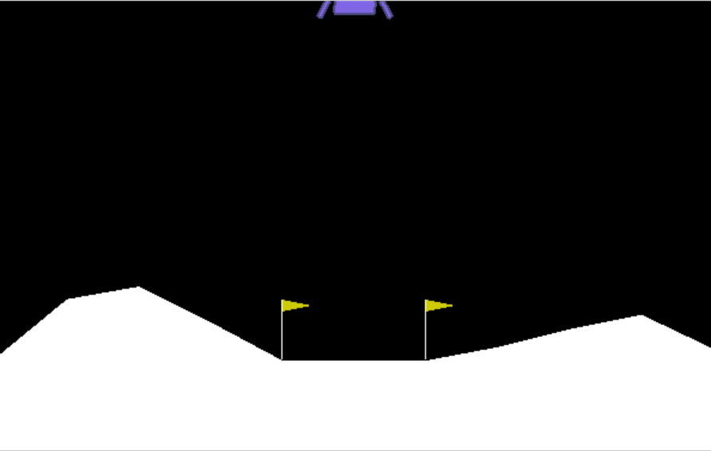

# Lunar-Lander
Implement reinforcement learning to train lunar lander to land on the moon safely. Assignment from Machine Learning Specialization by DeepLearning.AI and Standford

* <i>Write an unsupervised learning algorithm to **Land the Lunar Lander** Using Deep Q-Learning</i>

    - The Rover was trained to land correctly on the surface, correctly between the flags as indicators after many unsuccessful attempts in learning how to do it.
    - The final landing after training the agent using appropriate parameters : 



## Instruction
Tested on *Python 3.11*
1. Create virtual environment
    ```
    python -m venv lunar_lander
    ``` 

    Activate the virtual environment on **Linux/macOS**
    ```
    source lunar_lander/bin/activate
    ```

    Activate the virtual environment on **Windows**
    ```
    my_env\Scripts\activate.bat
    ```

2. Install `Xvfb` to use `pyvirtualdisplay` for virtual display

    MacOS: Xvfb is not directly available on macOS. However, you can install XQuartz, which provides an X11 server that includes Xvfb functionality:
        
    - Download and install XQuartz from https://www.xquartz.org/.

3. Install `swig` for `box2d-py` and `gym[box2d]`

    MacOS:

    ```
    brew install swig
    ```

4. Install dependencies
    ```
    pip install -r requirements.txt
    ```

4. Start the program
    Run the `.ipynb` file on **Jupyter Notebook** or **Jupyer Lab**